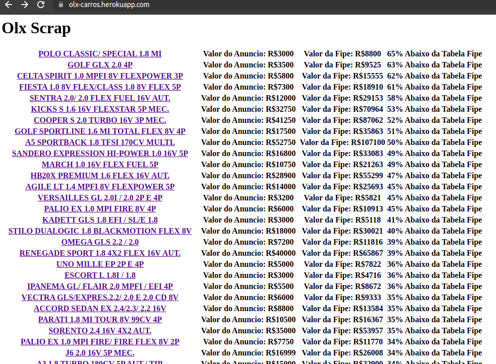

# olx_cars
Web Scraping OLX

O script faz scraping dos ultimos anuncios de carros na olx e calcula a tabela fipe de cada carro para comparar seus respectivos preços e retornar os carros que estão com menor valor em relação a tabela fipe.

https://carlsec.medium.com/web-scraping-de-carros-abaixo-da-tabela-fipe-na-olx-9acd2eb2163c

